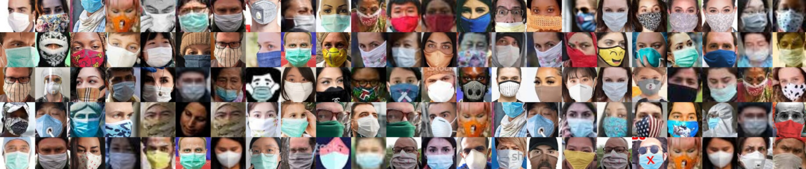

# Face Mask Classification Experiments

Репозиторий с экспериментами по модели классификации наличия маск

## Описание задачи

Нужно построить модель которая бы могла определять по фотографии, надел ли человек маску или нет.

Датасет взят с [каггла](https://www.kaggle.com/ashishjangra27/face-mask-12k-images-dataset). Но никто не запрещает вам найти дополнительные данные для обучения.

### Датасеты

- Обучать модель используя Train выборку

- Валидировать и подбирать гиперпараметры через Valid

- Проводить итоговую оценку эксперимента по Test выборке

### Метрики

В качестве метрик использовать:

- Accuracy

- Precision

- Recall

- F1-Score

## Что нужно сделать

1. Склонировать репозиторий

1. Создать отдельную ветку

1. Настроить окружение, установить зависимости через `pip install -r reuqirements.txt`

1. Настроить библиотеку [`kaggle-cli`](https://github.com/Kaggle/kaggle-api#api-credentials) для загрузки данных из kaggle.com

1. Вытащить данные через команду `dvc pull`

1. Реализовать код для обучения модели, обернуть эксперимент в dvc run

1. Создать Pull Request со своим экспериментом. Обязательно сделай описание эксперимента

1. Провести ревью чьего-нибудь эксперимента (не своего!). Дать обратку по эксперименту и коду.

## Замечания

- Весь эксперимент должен воспроизводиться через `dvc repro experiment.dvc`

- По результату каждого эксперимента должны быть сохранены метрики в dvc

- Соблюдать файловую структуру проекта. Не должно быть такого, что в `src/data/` будет находиться код для обучения модели

- По минимуму использовать ноутбуки. Если весь ваш эксперимент записан в ноутбуках, то это сразу минус

- Не сохранять данные (фотографии или модели) в гите! При необходимости, загружайте все в dvc.

- Для загрузки данных необходимо настроить консольную утилиту для kaggle. Прочитать как это сделать можно тут.

## Как проводить ревью эксперимента

1. Убедись, что тебе по описанию Pull Request'а понятно, в чем заключается эксперимент

1. Проверь, что эксперимент воспроизводится через `dvc repro`

1. Посмотри на сам код эксперимента. Убедись, что тебе понятно как он работает. При необходимости можешь попросить автора добавить комментарии к коду.

## Структура проекта
--------

    ├── LICENSE
    ├── Makefile           <- Makefile with commands like `make data` or `make train`
    ├── README.md          <- The top-level README for developers using this project.
    ├── data
    │   ├── external       <- Data from third party sources.
    │   ├── interim        <- Intermediate data that has been transformed.
    │   ├── processed      <- The final, canonical data sets for modeling.
    │   └── raw            <- The original, immutable data dump.
    │
    ├── notebooks          <- Jupyter notebooks. Naming convention is a number (for ordering),
    │                         the creator's initials, and a short `-` delimited description, e.g.
    │                         `1.0-jqp-initial-data-exploration`.
    │
    ├── reports            <- Generated analysis as HTML, PDF, LaTeX, etc.
    │   └── figures        <- Generated graphics and figures to be used in reporting
    │
    ├── requirements.txt   <- The requirements file for reproducing the analysis environment, e.g.
    │                         generated with `pip freeze > requirements.txt`
    │
    ├── setup.py           <- makes project pip installable (pip install -e .) so src can be imported
    ├── src                <- Source code for use in this project.
    │   ├── __init__.py    <- Makes src a Python module
    │   │
    │   ├── data           <- Scripts to download or generate data
    │   │   └── make_dataset.py
    │   │
    │   ├── features       <- Scripts to turn raw data into features for modeling
    │   │   └── build_features.py
    │   │
    │   ├── models         <- Scripts to train models and then use trained models to make
    │   │   │                 predictions
    │   │   ├── predict_model.py
    │   │   └── train_model.py
    │   │
    │   └── visualization  <- Scripts to create exploratory and results oriented visualizations
    │       └── visualize.py
    │
    └── tox.ini            <- tox file with settings for running tox; see tox.readthedocs.io

--------

<small>Project based on the <a target="_blank" href="https://drivendata.github.io/cookiecutter-data-science/">cookiecutter data science project template</a>. #cookiecutterdatascience</small>

